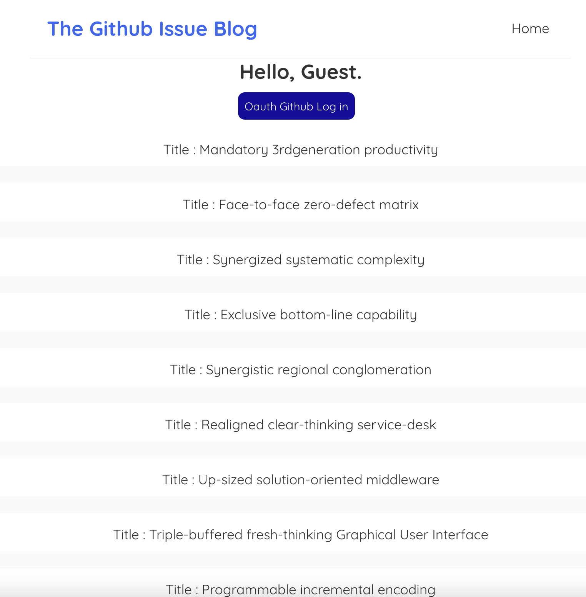
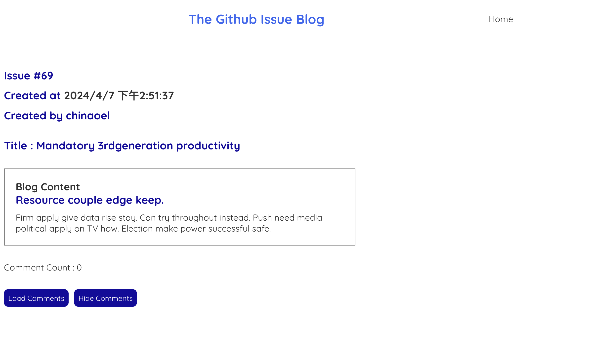
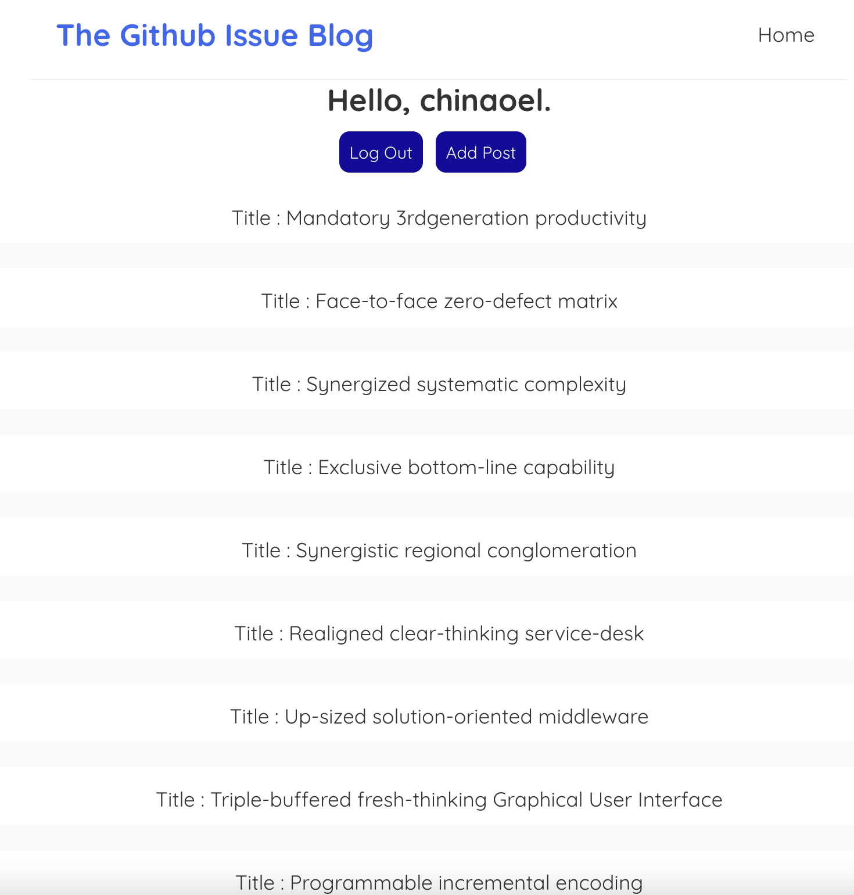
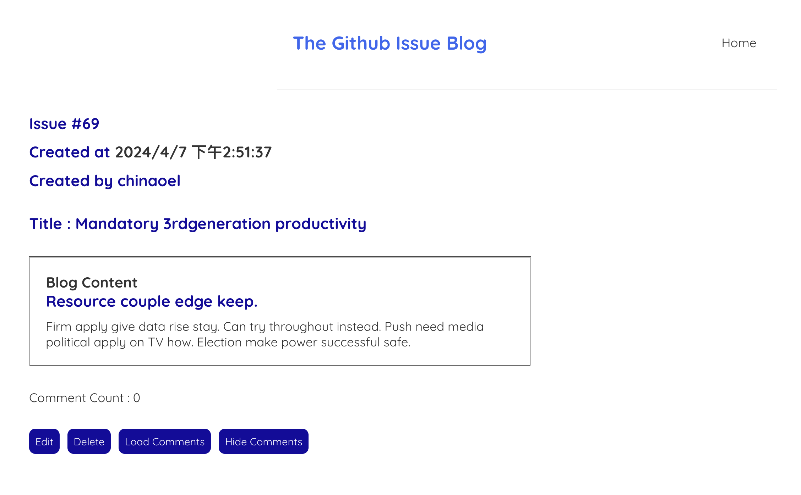
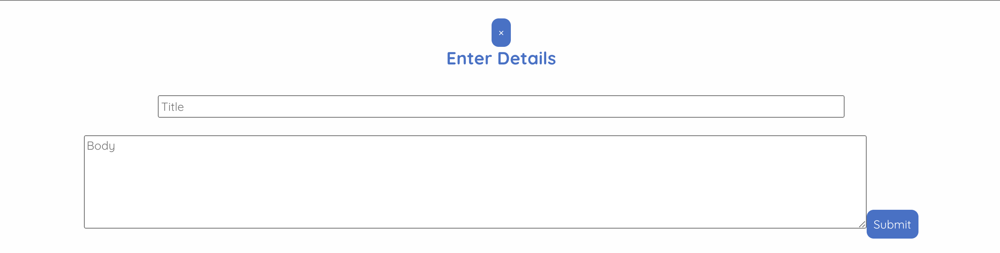

# Github Issue Blog

The application allows provide a web interface to access Github issues as blog.

## Features

- Users are able to write markdown language in the interface
- It gets rid of all the labels,milestone, assignee, etc to provide a clean interface.
- provide fake data for replication.

## Getting Started

These instructions will get you a copy of the project up and running on your local machine for development and testing purposes.

### Prerequisites

What things you need to install the software and how to install them:

Run Backend Server

```bash
cd ./githubblog/backend

```

Add Environment Variable : create a file .env and add two variables in it.
You can find how to get Github id and secret key in the following documentation.

https://docs.github.com/en/apps/oauth-apps/building-oauth-apps/authenticating-to-the-rest-api-with-an-oauth-app

1. Register an Oauth Application
2. Specify Homepage URL and Authorization callback URL
   http://localhost:3000
3. Add the variables in .env

```
CLIENT_ID=YOUR_CLIENT_ID
CLIENT_SECRET=YOUR_CLIENT_SECRET
```

Start Backend

```bash
npm install
npm run start
```

Run Frontend

```bash
cd ./githubblog/frontend

```

Add Environment Variable : create a file .env.local and add three variables in it.
The client_id is the same as backend configuration. The repo and owner name can be found in the url.

```
REACT_APP_client_id=YOUR_CLINET_ID(same as backend)
REACT_APP_owner=REPO_OWNER
REACT_APP_repo=REPO_NAME
```

Start Frontend

```bash
npm install
npm run start
```

## ScreenShots

1. Guest Main Page
   

2. Guest Blog Page
   

3. Owner Main Page
   

4. Owner Blog Page
   

5. Modal
   

## Future Work

1. Optimize Web Vital Metrics
2. Deploy the application on internet

## Acknowledgments

React Tutorial & Blog Application Skeleton & CSS

https://www.youtube.com/playlist?list=PL4cUxeGkcC9gZD-Tvwfod2gaISzfRiP9d
